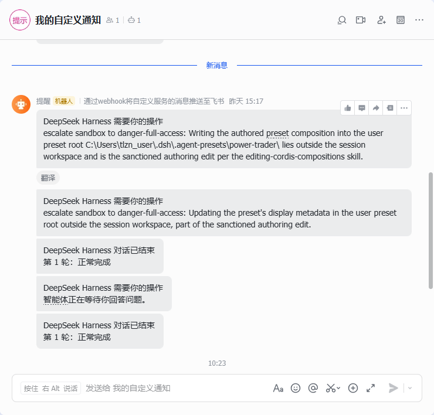
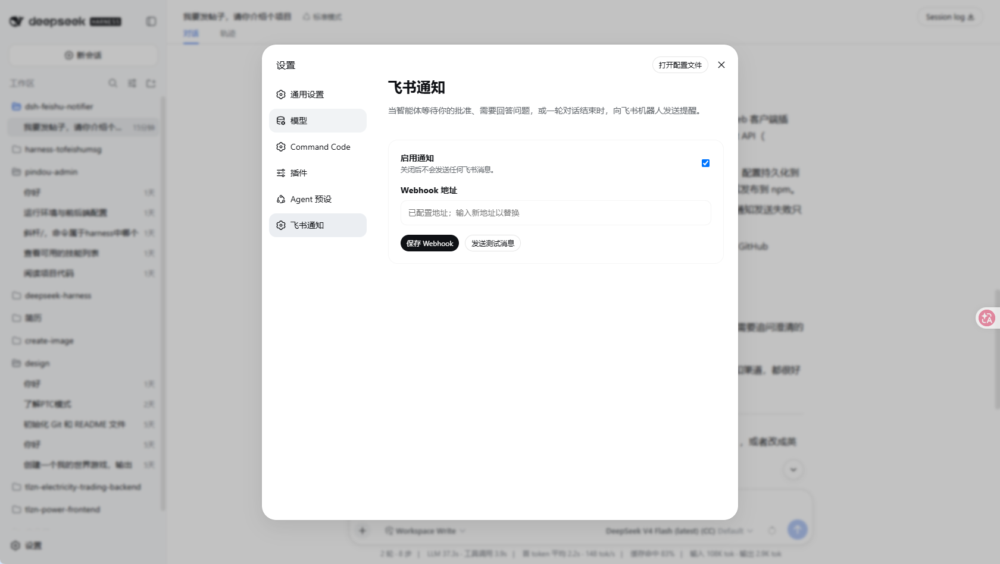

# dsh-feishu-notifier

一个 DeepSeek Harness Bundle：当智能体请求用户批准、等待用户回答问题或确认计划，以及一轮对话结束时，向飞书机器人发送文本通知。

## 使用要求

- DeepSeek Harness `0.1.0-rc.5` 或兼容版本。
- Node.js `22.19+`。
- 在 Web 设置中配置飞书自定义机器人 Webhook。



## 本地开发

```sh
pnpm install
pnpm run build
pnpm pack:check
```

构建会生成：

- `lib/index.js`：Node/Cordis Loader 入口；
- `lib/client.js`：Web 浏览器插件入口。

## 从 npm 安装

将插件发布到 npm 后，用户可以直接使用以下命令安装到 `web` Profile：

```sh
dsh plugin --profile web add dsh-feishu-notifier
dsh --profile web
```

如果使用源码方式运行 DeepSeek Harness，则将 `dsh` 替换为 `pnpm dsh`：

```sh
pnpm dsh plugin --profile web add dsh-feishu-notifier
pnpm dsh --profile web
```

启动后打开：

```text
设置 → 飞书通知
```

填写飞书机器人 Webhook，点击“保存 Webhook”，然后点击“发送测试消息”验证连接。配置会通过插件自己的 Host API 持久化到 DSH 的 `settings.yaml`，通常位于 `C:\Users\<用户名>\.dsh\settings.yaml`。真实 Webhook 不会包含在 npm 包中，每位用户都需要配置自己的地址。



## 从 GitHub 安装

建议使用 release tag 或 commit SHA，确保安装内容可复现：

```sh
pnpm dsh plugin --profile demo add github:blooming-fang/dsh-feishu-notifier
```

从 GitHub 安装时会执行 `prepare` 构建插件。只应安装可信仓库中的代码；pnpm 可能要求在 Profile 的 workspace 配置中加入 `allowBuilds` 授权。

## 通知事件

插件会发送以下通知：

- 用户审批请求；
- `ask_user_question` 用户问题请求；
- `exit_plan_mode` 计划确认请求；
- `turn/end` 对话轮次结束事件，并将完成、错误、取消和中断原因转换为可读文本。

Webhook 属于敏感设置，保存后不会返回给浏览器。不要把真实 Webhook 地址提交到 GitHub 或发布到 npm。
