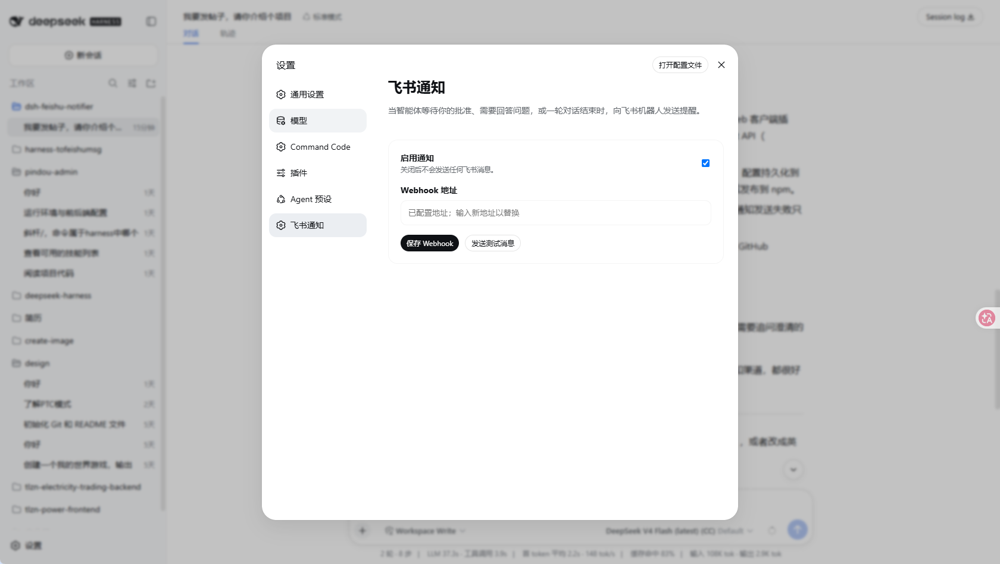
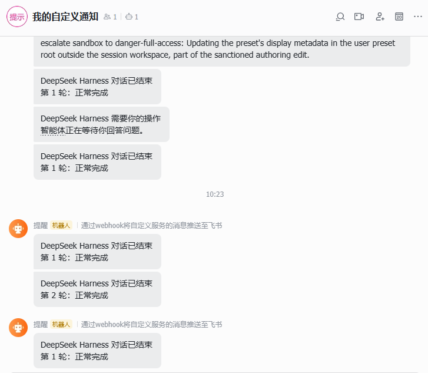

# dsh-feishu-notifier

一个 DeepSeek Harness Bundle：当智能体请求用户批准、等待用户回答问题或确认计划，以及一轮对话结束时，向飞书机器人发送文本通知。



## 使用要求

- DeepSeek Harness `0.2.0-rc.1` 或兼容版本。
- Node.js `22.19+`。
- 在 Web 设置中配置飞书自定义机器人 Webhook。


## 本地开发

```sh
pnpm install
pnpm run typecheck
pnpm run smoke
pnpm run build
pnpm pack:check
```

`pnpm run smoke` 会用桩上下文加载 `lib/index.js` 与 `lib/client.js`，校验通知分发、设置契约（volatile 字段与 secret 脱敏）、`settings.section` 注册，并复刻 `dsh-app-boot` 的插件版本校验、断言每个 dsh peer 范围都能接纳目标运行时版本 —— 升级 DSH 后应优先运行它，版本范围失配会在这里而非启动时报错。

构建会生成：

- `lib/index.js`：Node/Cordis Loader 入口；
- `lib/client.js`：Web 浏览器插件入口。

## 从 npm 安装

将插件发布到 npm 后，用户可以直接使用以下命令安装到 `web` Profile：

```sh
dsh plugin --profile web add dsh-feishu-notifier
dsh --profile web
```

如果使用源码方式运行 DeepSeek Harness，则将 `dsh` 替换为 `pnpm dsh`：

```sh
pnpm dsh plugin --profile web add dsh-feishu-notifier
pnpm dsh --profile web
```

启动后打开：

```text
设置 → 飞书通知
```

填写飞书机器人 Webhook，点击“保存 Webhook”，然后点击“发送测试消息”验证连接。

配置通过 DSH 的 settings 服务写入当前 Profile 的补丁文件，通常是 `~/.dsh/profiles/<profile>/cordis.patch.yml`。真实 Webhook 不会包含在 npm 包中，每位用户都需要配置自己的地址。




## 从 GitHub 安装

建议使用 release tag 或 commit SHA，确保安装内容可复现：

```sh
pnpm dsh plugin --profile demo add github:blooming-fang/dsh-feishu-notifier
```

从 GitHub 安装时会执行 `prepare` 构建插件。只应安装可信仓库中的代码；pnpm 可能要求在 Profile 的 workspace 配置中加入 `allowBuilds` 授权。

## 通知事件

插件会发送以下通知：

- 用户审批请求（`approval/request` 瀑布事件）；
- `ask_user_question` 用户问题请求；
- `exit_plan_mode` 计划确认请求；
- `turn/end` 对话轮次结束事件，并将完成、错误、取消、分叉和中断原因转换为可读文本。子代理（`session.header.origin === 'subagent'`）的轮次结束不会触发通知。

Webhook 属于敏感设置（Config 中声明为 `role('secret')`），保存后不会返回给浏览器。不要把真实 Webhook 地址提交到 GitHub 或发布到 npm。


## 从旧版本升级

### 从 0.2.x 升级到 0.3.0（DSH 0.2.0-rc.1）

DSH `0.2.0-rc.1` 新增了插件版本校验：启动导入插件前，`dsh-app-boot` 会读取插件 `package.json` 的 `peerDependencies`，把所有 `@deepseek-ai/dsh` 与 `@deepseek-ai/dsh-*` 声明与当前运行时版本逐一比对（含预发布版本）。任一范围不匹配即拒绝加载该插件并提示 `Plugin ... is incompatible with dsh ...`。

因此本次升级是**必需的**，而不是可选的：插件 `0.2.2` 声明的 `@deepseek-ai/dsh-settings: ^0.1.7-alpha.1` 无法满足 `0.2.0-rc.1`，会在启动时被直接拒绝。`0.3.0` 的改动：

- 所有 `@deepseek-ai/dsh-*` 依赖与 peer 范围提升到 `^0.2.0-rc.1`，`@deepseek-ai/cordis` 提升到 `^4.0.4`，`@deepseek-ai/schemastery` 提升到 `^3.18.4`；
- 新增 `scripts/smoke.mjs` 版本校验回归：用 `semver` 复刻 `dsh-app-boot` 的判定逻辑，断言每个 dsh peer 范围都能接纳目标运行时版本，避免下次再出现同类静默失败；
- 面向 DSH 0.2.0-rc.1 重新构建 `lib/index.js` 与 `lib/client.js`。

插件使用的 settings、webServer、slots/configForms、session 事件与 `__ModuleLoader__` 客户端契约在 0.2.0-rc.1 中均未发生破坏性变化，因此业务代码无需改动。

### 从 0.1.x 升级到 0.2.x（DSH 0.1.7-alpha.1）

DSH `0.1.7-alpha.1` 用 settings 服务的配置表单取代了旧的 `ctx.settings.register` scope API：

- 配置项改为 `volatile` 字段，设置服务就地更新，插件无需重新挂载即可读到最新值；
- 浏览器端改用 `ctx.configForms` 读写命名空间 `feishu-notifier`，Webhook 仍为只写字段；
- 测试消息仍由插件自己的 Host 路由 `POST /api/feishu-notifier/test` 发送；
- `@deepseek-ai/schemastery` 改为直接依赖：`.volatile()` 需要 `>=3.18.3`，而 Profile 使用 `nodeLinker: hoisted` + `autoInstallPeers: false`，peer 依赖不会被安装。

升级后如果旧的 `~/.dsh/settings.yaml` 已迁移为 `settings.yaml.imported`，请打开“设置 → 飞书通知”重新填写一次 Webhook。
